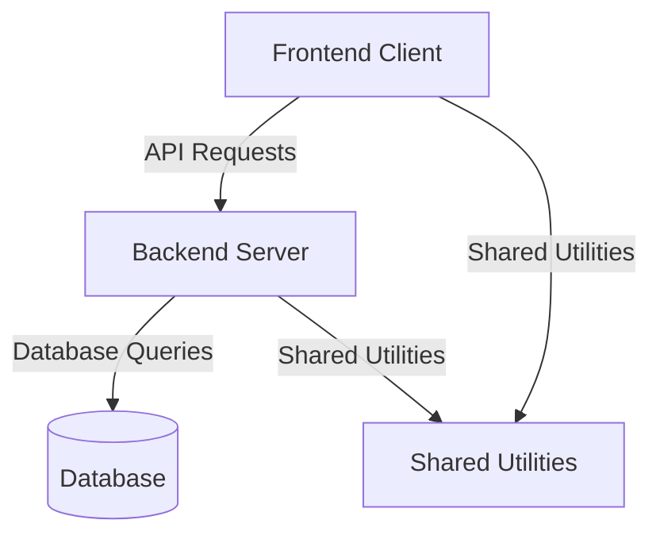

# CollaborativeScribe

## Overview

CollaborativeScribe is a TypeScript-based collaborative application designed with a client-server architecture. It includes a frontend client, a backend server, and shared utilities to streamline development. This project leverages modern web technologies to provide a seamless collaborative experience.

---

## Table of Contents

- [Overview](#overview)
- [Features](#features)
- [Prerequisites](#prerequisites)
- [Setup Guide](#setup-guide)
  - [Clone the Repository](#1-clone-the-repository)
  - [Install Dependencies](#2-install-dependencies)
  - [Configure Environment Variables](#3-configure-environment-variables)
  - [Build the Project](#4-build-the-project)
  - [Run the Development Server](#5-run-the-development-server)
  - [Run Tests](#6-run-tests)
- [Project Structure](#project-structure)
- [Architecture Diagram](#architecture-diagram)
- [Key Commands](#key-commands)
- [Contributing](#contributing)
- [License](#license)

---

## Features

- **Client-Server Architecture**: Separation of frontend and backend for modular development.
- **TypeScript Support**: Strongly typed codebase for better maintainability.
- **Shared Utilities**: Reusable code shared between client and server.
- **Modern Tooling**: Uses `vite` for fast development and `ESNext` for modern JavaScript features.

---

## Prerequisites

Before setting up the project, ensure the following tools are installed:

1. **Node.js**: Version 16 or higher.
2. **Package Manager**: `npm` (comes with Node.js) or `yarn`.
3. **TypeScript**: Install globally using `npm install -g typescript`.
4. **Git**: For version control.
5. **Code Editor**: Visual Studio Code is recommended.

---

## Setup Guide

### 1. Clone the Repository

Clone the repository and navigate to the project directory:

```bash
git clone <repository-url>
cd CollaborativeScribe
```

### 2. Install Dependencies

Install all required dependencies for the project:

```bash
npm install
```

### 3. Configure Environment Variables

Create a `.env` file in the root directory and configure the following variables:

```env
PORT=3000
DATABASE_URL=<your-database-url>
VITE_API_URL=http://localhost:3000/api
```

### 4. Build the Project

Compile the TypeScript files (if needed):

```bash
npm run build
```

### 5. Run the Development Server

Start the development server to test the application locally:

```bash
npm run dev
```

### 6. Run Tests

Run the test suite to ensure the application is functioning correctly:

```bash
npm test
```

---

## Project Structure

- **`client/`**: Contains the frontend code (React or similar framework).
- **`server/`**: Contains backend logic (Node.js/Express or similar framework).
- **`shared/`**: Contains shared utilities, types, or constants used by both client and server.
- **`tsconfig.json`**: TypeScript configuration file for the project.

---

## Architecture Diagram

The following diagram illustrates the high-level architecture of CollaborativeScribe:



---

## Key Commands

- **Install Dependencies**:
  ```bash
  npm install
  ```
- **Start Development Server**:
  ```bash
  npm run dev
  ```
- **Build Project**:
  ```bash
  npm run build
  ```
- **Run Tests**:
  ```bash
  npm test
  ```

---

## Contributing

We welcome contributions to CollaborativeScribe! To contribute:

1. Fork the repository.
2. Create a new branch for your feature or bugfix.
3. Commit your changes with clear and concise messages.
4. Submit a pull request for review.

Please ensure your code adheres to the project's coding standards and includes appropriate tests.

---

## License

This project is licensed under the MIT License. See the `LICENSE` file for details.
